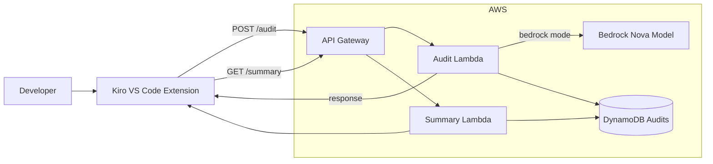

# InfraSage

InfraSage is an AI-assisted Terraform governance workflow that audits Infrastructure-as-Code on save, generates a remediation patch (when possible), and tracks governance trends over time.

## End-to-end architecture

## What happens when you save a `.tf` file

- **Trigger**: The Kiro extension listens for `.tf` saves.
- **Audit request**: It sends `POST /audit` with the current file content.
- **Audit execution**:
  - **Bedrock mode** (`AUDITOR_MODE=bedrock`): Lambda calls Bedrock to generate:
    - `alignment_score` (0–100)
    - `violations[]`
    - `unified_diff_patch` (a patch the extension can apply)
    - `carbon_delta_total` (optional)
  - **Local mode** (`AUDITOR_MODE=local`): Lambda runs a deterministic “sim” auditor for demos when Bedrock isn’t available.
- **Persistence**: Lambda writes an audit record to DynamoDB (`audit_id`, timestamp, score, violation_count, carbon_delta_total, patch_applied=false, file_name).
- **UI update**: The extension renders:
  - **Audit Results**: score, violations, diff preview, Apply Patch button (only if a patch is present)
  - **Governance Summary**: fetched from `GET /summary`

## Apply Patch and re-audit flow

- If a patch is present, the extension can **apply** the unified diff to the open Terraform file.
- After applying, it calls `POST /audit/{audit_id}/applied` to mark the audit as applied (and optionally record how many violations were resolved).
- Saving the file triggers a **re-audit** so you can see a clean/updated result immediately.

## API surface (high level)

- **`POST /audit`**
  - **Input**: `{ fileName, fileContent }`
  - **Output**: `{ audit_id, timestamp, alignment_score, violation_count, carbon_delta_total, violations, unified_diff_patch, patch_applied }`
- **`POST /audit/{id}/applied`**
  - **Input**: `{ resolvedViolationCount }` (best-effort)
  - **Effect**: marks `patch_applied=true` for that `audit_id`
- **`GET /summary`**
  - **Output**: `{ average_alignment, trend_delta, total_carbon_delta, violations_resolved, recent_audits[] }`

## Key components in this repo

- **`backend/`**: Lambda/API implementation (audit + summary + DynamoDB persistence)
- **`kiro-extension/`**: Kiro/VS Code extension (webview UI, on-save audit, apply patch, summary rendering)

## Notes on “local auditor” mode

Local mode is meant for demos and offline development. It returns the same *shape* as the Bedrock response, but rules and patches are intentionally simple and deterministic.

## Contact

For contributions email: [shammahmatasva@gmail.com](mailto:shammahmatasva@gmail.com)  
Website: [matasva.com](https://www.matasva.com)
